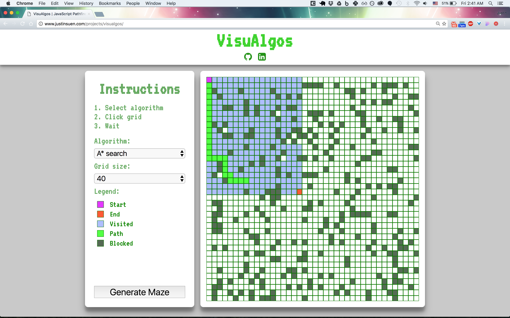
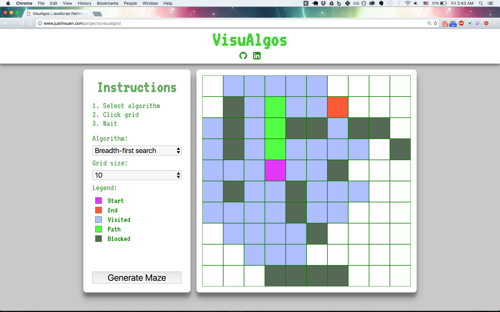

# VisuAlgos

[VisuAlgos](http://www.justinsuen.com/projects/visualgos) is a JavaScript project intended to help users visualize how different algorithms work. It is created with vanilla JavaScript, jQuery, and styled with CSS3 in HTML5.


## Features
- [x] Generate mazes
- [x] Set start and end points
- [x] Choose algorithm to be ran
- [x] An instructions tooltip

## Design
This visualizer uses a simple grid system where a starting block is placed at the `(0, 0)` position. To run a visualization, the user just has to click an open square on the grid and the algorithm will run.



The side bar contains simple intuitive instructions, options for the algorithm and grid, and a minimal legend for identifying grid components. The visualizer displays the visited squares first and once the end node is visited, a path is drawn from start to end. The path is the shortest path calculated using the algorithm chosen.



The visualizer supports different grid sizes based on user preference. The **Generate Maze** button allows the user to generate randomized mazes as desired.


As the algorithm runs almost instantly, `setTimeout` methods were used the build the visited nodes on screen. Later, the path is also drawn with a calculated timeout.


After three seconds pass, the grid is cleared with the end node acting as the new start node. Here is a sample of the helper methods.

```javascript
showActive(path, i) {
  this.getElement(path[i]).addClass("path");
  setTimeout(() => {
    if (i < path.length - 2)
      this.showActive(path, i+1);
  }, 800/this.gridSize);
}
```

## Algorithms

Currently, the visualizer supports three algorithms: Breadth-first search, Depth-first search, and A* search. All of these are implemented here as path-finding algorithms with a Manhattan heuristic and no diagonals allowed.

Manhattan distances are calculated as follows:

```javascript
static manhattan(p1, p2) {
  const dx = Math.abs(p2.x - p1.x);
  const dy = Math.abs(p2.y - p1.y);
  return dx + dy;
}
```

### A* Search

The A* algorithm was implemented with arrays acting as the open and closed sets. Graph nodes were stored in a class with respective `f, g, and h` scores. Here are snippets of the implementation:

```javascript
// Here the lowest scored node is found for the next visit
for (let i = 0; i < openSet.length; i++) {
  if (openSet[i].f < openSet[lowestInd].f)
    lowestInd = i;
}

...

// With all the neighbors of our currentNode, we calculate gScores
// accordingly and update fScores but using Manhattan distances.
for (let i = 0; i < neighbors.length; i++) {
  let n = neighbors[i];

  if (n.closed || n.weight === 0)
    continue;

  let gScore = currNode.g + 1;
  let bestGScore = false;

  if (!n.visited) {
    bestGScore = true;
    n.visited = true;
    n.h = AStar.manhattan(n.pos, this.end.pos);
    openSet.push(n);
  } else if (gScore < n.g) {
    bestGScore = true;
  }

  if (bestGScore) {
    n.parent = currNode;
    n.g = gScore;
    n.f = n.g + n.h;
  }
}
```

### Breadth-first Search

BFS here was implemented with an array as a queue. Nodes were pushed into a closed set once it was visited.

```javascript
currNode.closed = true;
closedSet.push(currNode);

let neighbors = graph.neighbors(currNode);
for (let i = 0; i < neighbors.length; i++) {
  let n = neighbors[i];

  if (n.closed || n.weight === 0)
    continue;

  if (!n.visited) {
    n.visited = true;
    n.parent = currNode;
    queue.push(n);
  }
}
```

### Depth-first Search

For this project, DFS was implemented with an array as the stack. To find the path associated with the proper nodes, we also had to have a "path cache" array stored with the node:

```javascript
// Each stack push will be an array of two things:
// 1. The node
// 2. The current path that leads to the node
let stack = [[start, []]];
```

As with BFS and A*, we visit nodes and push it into our storage:

```javascript
for (let i = 0; i < neighbors.length; i++) {
  let n = neighbors[i];

  if (n.weight === 0)
    continue;

  // Storage here looks different with the extra arrays
  if (n.x === end.x && n.y === end.y) {
    return { path: currPath.concat([n]), closedSet: closedSet.concat([currNode]) };
  }

  if (!n.visited) {
    n.visited = true;
    n.parent = currNode;
    stack.push([n, currPath.concat([n])]);
  }
}
```

## Future

Here are some features that I would like to implement in the future:
- [ ] Node weights
- [ ] Weighted path finding with Kruskal's, Dijkstra's, and Prim's
- [ ] User drawable mazes and setting start/end points
- [ ] User selectable block frequency
- [ ] Different heuristics and allowing diagonals
- [ ] Information on algorithm runtime, resources, and code snippet
- [ ] Fix known bug of user double clicking
