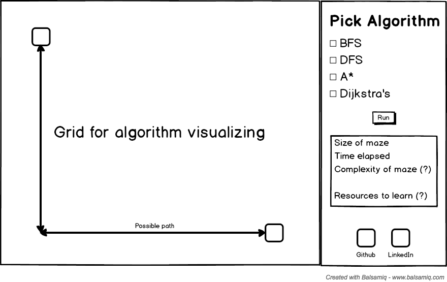

# Algorithm Visualizer

## Background
In this algorithm visualizer, I will be tackling various path finding and search algorithms such as BFS, DFS, and A*. If time permits, I will also visualize sorting algorithms.

## Functionality and MVP
With this visualizer, users will be allowed to
- [ ] Generate mazes
- [ ] Set start and end points
- [ ] Choose algorithm to be ran

This project will also include:
- [ ] An about tooltip with instructions
- [ ] A production README

## Wireframe
This app consists of a single screen with a grid, start and end points, and various statistics. Links to my Github and LinkedIn will also be available on the bottom of the page.

## Architecture and Technologies
This project will be implemented with the following technologies:
* Vanilla Javascript will handle the algorithms and controls.
* HTML5 Canvas will be used for rendering grid and colors.
* Webpack will bundle the scripts
* Babel will transpile ES6 to ES5.

## Components

* `sidebar.js`: sidebar with information and buttons
* `grid.js`: grid with start and end points (possible maze implementation for bonus)

## Implementation Timeline

### Day 1
Complete vanilla javascript
* Configure Webpack
* Correctly implement all algorithms

### Day 2 & 3
Learning some kind of grid visual library
* Render start and end locations
* Render paths and progress

### Day 4
Touchup
* Make buttons for users to choose algorithm
* Make start and end points movable
* Bonuses if time permits

### Bonus features
- [ ] User create mazes
- [ ] Sorting algorithms
